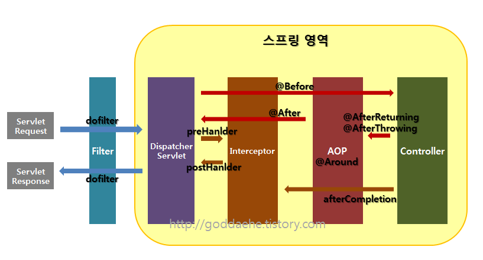

- 내가 이번 면접에서 실패 했던 부분, 마음이 아프고 제대로 공부 하지 못했다는 반성을 하기 위해 다시 공부한다. 
- 다른 소를 받기 위해서는 무너진 외양간을 고쳐야 소를 받을 수 있다.
- 자바에서 공통적으로 처리해야 할 업무 들은 위에 필터와 인터셉터 AOP를 통해 처리 된다.
- 공통 업무의 주요 부분은 로그인 관련 세션 체크, 권한체크, Xss방어, PC웹과 모바일웹 분기 처리 , 로깅, 페이지 인코딩 등을 수행한다.
- 각각의 서비스 코드에서 그 모든 부분을 처리 하게 된다면 중복코드가 많아지고 소스관리가 되지 않아 공통부분의 기능을 분리하게 위해 스프링에는 해당 기능을 통해 기능들을 관리하게 된다.

### - Filter > Interceptopr > Aop > Interceptor > Filter

- Interceptor와 Filter는 Servlet 단위에서 실행된다. 
- 반면 AOP는 메소드 앞에 Proxy패턴의 형태로 실행된다.
- 실행 순서를 보면 **Filter가 가장 밖에 있고 그 안에 Interceptor, 그 안에 AOP가 있는 형태이다.** 이 부분을 무식하게 AOP > Interceptor > FIlter 순이라고 설명했다.. 무친...
- Request -> Filter -> InterCeptopr -> AOP -> Controller(서비스) -> AOP -> InterCeptor -> Filter -> Response 이 순서로 이루어진다.  

    - 메소드 실행관점에서 본 순서
    1) 서버을 실행 시키며 서블릿이 올라오는 동안 init이 실행 되면 그 후 dofilter가 실행된다. 
    2) 컨드롤러 들어가기 전 preHandler 가 실행된다.
    3) 컨트롤러에서 나와 PostHandler, after completion, dofilter 순으로 실행된다. 
    4) 서블릿 종료시 destroy가 실행된다.

## - Filter
1) 요청과 응답을 거른뒤 정제하는 역활
2) 서블릿 필터는 DispatchServlet 이전에 실행이 되는 데 필터가 동작하도록 지정된 자원의 앞단에서 요청 내용을 변경하거나, 여러가지 체크를 수행할 수 있다.
3) 주 사용처 : 인코딩 변환 처리, XSS 방어, 입력데이터 검증 등 
4) 필터의 실행 메서드 : init() 필터의 인스턴스 초기화, doFilter() 전/후 처리, destroy() 필터 종료

## - Interceptor
1) 요청에 대한 작업 전/후로 가로챈다.  
2) 필터는 스프링 컨택스트 외부에 존재하고 스프링과 무관한 자원에 주로 적용됨  
3) 인터셉터는 스프링의 DispatcherServlet이 컨트롤러를 호출하기 전, 후로 키어듬  
4) 스프링 컨택스트 내부에서 Controller(Handler)에 관한 요청과 응담에 대해 처리하게됨  
5) 스프링의 모든 Bean 객체에 접근이 가능함  
6) 인터셉터는 여러개를 사용가능  
7) 주로 로그인 체크, 권한체크, 프로그램 실행 시간 계산 작업, 작업 로그 확인 등  
8) 인터셉터의 실행 메서드 : PreHanler() : 컨트롤러 실행전, PostHandler() : 컨트롤러 메서드 실행 직후 렌더링 되기 전, afterCompletion() : view가 랜더링 되고난 이후  

## - AOP
1) OOP를 보완하기 위해 나온 개념  
2) 객체지향 프로그래밍을 했을 때 중복을 줄일 수 없는 부분을 줄이기 위해 종단면에서 바라보고 처리한다.  
3) **주로 로깅, 트랜잭션, 에러처리 등 비즈니스단에서 메서드에서 조금 더 세밀하게 조정하고 싶을 경우 사용** ㅜ_ㅜ   
4) 인터셉터나 필터와는 달리 메소드 전후의 지점에 자유롭게 설정이 가능하다.  
5) 인터셉터나 필터는 주소(URL)대상을 구분해서 걸러낸다면  
6) **AOP는 주소, 파라미터, 어노테이션 등 다양한 방법으로 대상을 지정가능..**  
7) AOP(Advice)와 Interceptor(HandlerInterceptor)의 가장 큰 차이는 파리미터의 차이  
8) Advice의 경우 JointPoint나 ProceedingJointPoint등을 활용해서 호출한다.  
9) Interceptor의 경우 필터와 같이 HttpServletRequest, HttpServletResponse를 파라미터로 사용함  
10) AOP의 포인트 컷  
	- @Before 대상 메서드의 수행전  
	- @After 대상 메서드의 수행후  
	- @After-returning 대상 메서드의 정상적인 수행 후  
	- @After-throwing 예외 발생 후  
	- @Around 대상 메서듸 수행 전/후  